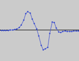
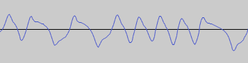

# trs80-cassette

TypeScript library for reading and writing TRS-80 Model I and Model III cassettes.

# Cassette coding schemes

## Low-speed (250 baud, 500 baud, and 1000 baud)

Low-speed encoding is used for 250 baud (Level 1 Basic) and
500 baud (Level 2 Basic). Some tapes have been found with 1000 baud
using the same encoding. The coding scheme is digital Frequency Modulation (FM)
without [NRZI](https://en.wikipedia.org/wiki/Non-return-to-zero#Non-return-to-zero_inverted).
The time values below apply to 500 baud.

Each **bit** is made of two 1 ms pulses, for a total of 2 ms (500 Hz).
Each **pulse** takes 1 ms: 125 µs positive, 125 µs negative, and 750 µs neutral.
In practice each pulse looks more like this on tape after various analog distortion:

The first pulse of each bit is the **clock pulse** and is always present. The second
pulse is the **data pulse** and can either be absent (1 ms of silence) for a 0 bit or
present for a 1 bit. This sample shows bit values 0, 1, and 0:

Each byte is written with its most-significant bit first.
The header is about 2040 zero bits (255 zero bytes) followed by the **sync byte** value 0xA5.
In some recordings the length of the zero bits in the header can increase
smoothly from 0.7 ms to 2 ms.
The program is then written as a sequence of bytes.
Between the header and the program there is a 1 ms pause. This is probably not intentional,
but a result of some processing the ROM has to do when writing the program. The pause
is just before the clock pulse of the first bit of the program.

The ROM reading code waits (indefinitely) until a pulse is seen, skips over
it (waiting 500 µs), then reads for 850 µs to see if a second pulse is
detected, indicating a 1 bit. The 1 ms pause after the header is therefore
harmless, since the ROM doesn't depend on the clock pulse being exactly 2 ms
after the previous clock pulse. Some recordings have these kinds of pauses
throughout, and reading code should be permissive with the timing of the
clock pulse.

References:

* Barden, Bill. *More TRS-80 Assembly Language Programming*, 1982. 221-227.

## High-speed (1500 baud)

The TRS-80 Model III high-speed (1500 baud) encoding is as follows:
Each bit is one cycle of a sine wave (positive half-cycle, then negative
half-cycle). A 0 bit is encoded with a 1320 Hz cycle, while a 1 bit is encoded
with a 2680 Hz cycle. These correspond to 768 and 1536 Z80 T-cycles at
2,027,520 Hz, the Model III's clock frequency.

More precisely, the timing of the square waves are:

* **Start bit**: 903 to 1007 T-cycles high and 765 T-cycle low (1777 total).
* **Zero bit**: 771 T-cycles high and 765 T-cycle low (1536 total).
* **One bit**: 378 T-cycles high and 381 T-cycle low (759 total).
* The high section of the data bit after the start bit is 6 T-cycles shorter.

Each byte is written with its most-significant bit first.
The header is 256 instances of the byte 0x55, followed by the **sync byte** value 0x7F.
The program is then written as a sequence of bytes, each starting with a
start bit of value 0 followed by the byte value.
Between the header and the program is a 1 ms pause. This is probably not intentional,
but a result of some processing the ROM had to do when writing the program.

This sample encodes the sequence `10011110`:

References:

* [Story behind "1500" baud decisions](https://forum.vcfed.org/index.php?threads/story-behind-1500-baud-decisions.57410/)
* [U.S. Patent 4443883, "Data synchronization apparatus"](https://patents.google.com/patent/US4443883)

# 1500 baud mystery

Note that in the high-speed encoding a 0 bit is about twice as long as a 1 bit.
This is a strange design, since 0 bits appear more often in programs: all
space characters (0x20) have 0 for 7 of their 8 bits; all ASCII characters
(comments, strings) have their most significant bit as 0; every start bit is a
zero.

In one Basic program I analyzed, there were 15,472 zero bits and 2960 one bits. That's
a recording time of 12.2 seconds, or 1508 baud. Had they swapped the meaning of
the two cycle times, that would have been reduced to 7.4 seconds, or 2489 baud.
Instead of a jump from 500 baud (on the Model I) to 1500 baud, they could have
claimed nearly 2500 baud! If anyone knows why they made this decision, please
let me know.

# License

Copyright &copy; Lawrence Kesteloot, [MIT license](LICENSE).

